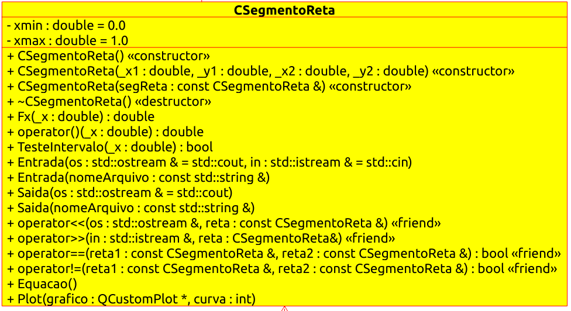

# QConducao

Resolução da Prova 1 referente a disciplina de Desenvolvimento de Software Orientado a Objeto em C++. Os diagramas referentes classes e aos casos de uso podem ser encontrados na pasta **Diagramas** e podem ser abertos com o Umbrello.

## Compilação e Execução

O projeto foi feito com base no framework voltado para interfaces gráficas **Qt**. Para a plotagem dos gráficos foi utilizados a biblioteca **QCustomPlot**. Portanto para que o projeto seja compilado e executado deve-se primeiro executar os seguintes comandos no terminal:

```bash
qmake
make
./QConducao
```

É necessário ter o qmake instalado no computador para que o processo seja executado normalmente.

## Utilização

Quando o programa inicia, uma janela é aberta solicitando o diretório onde estão os arquivos referente a conutividade térmica dos materiais, como é mostrado abaixo.


Basta selecionar o diretório e a janela da aplicação é aberta já com o gráfico de todos os materiais juntos.


O gráfico de cada material está na aba _Gráfico Material_.


Para adicionar um novo material basta clicar em _Arquivo_ e em seguida clicar em _Novo Material_. Por fim, digitar o nome do novo material.


Em seguida, é possivel adicionar um novo ponto no botão na parte inferior da direta _Adicionar Ponto_. Um ponto é removido de forma semelhante em _Remover Ponto_.


Quando todos os dados já estiverem sido inseridos basta clicar em _Criar Curva_ e um novo gráfico será gerado para esse material.


Também é possivel salvar as equações que formam cada reta. Para isso, clicar em _Arquivo_ e depois _Salvar Equacoes_.

Os gráficos também podem ser salvos em _Gráfico_ e em seguida clicando em _Salvar Gráfico_.

Para o cálculo do fluxo de calor que foi conduzido pelo material deve se entrar com os valores de temperatura, área, comprimento (dx) e variação de temperatura (dt) e também com o nome do material. Em seguida clicar em _Calcular_.


## Diagramas de Classes

### CReta


### CSegmentoReta



### CInterpolacao


### QConducao


### CFluxoCalor


### CCondutividade


